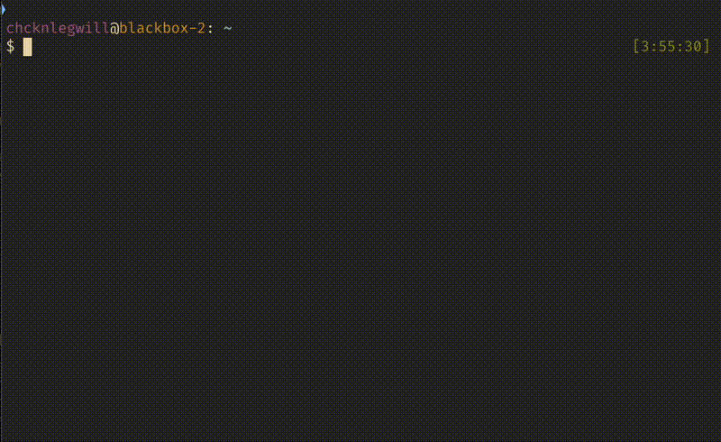

# chcknlegwill-cli
A Cli tool written in Go

## Usage:



## installation instructions

copy & paste below into your cli:
```curl -sSL https://raw.githubusercontent.com/chcknlegwill/chcknlegwill-cli/refs/heads/main/installer.sh | bash ```


